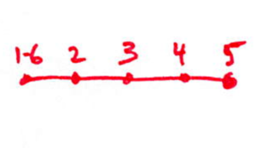
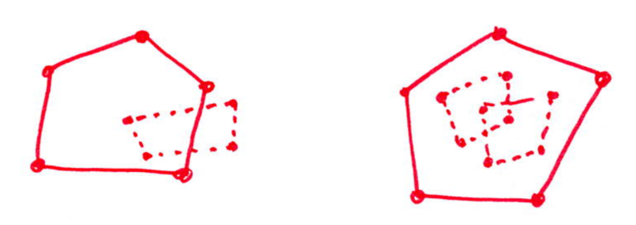
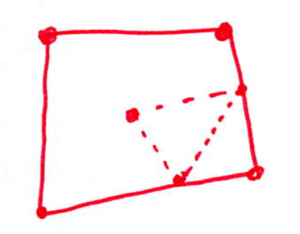
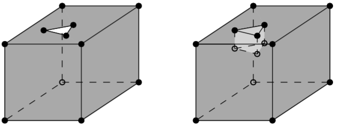
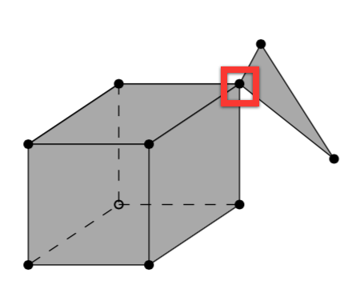
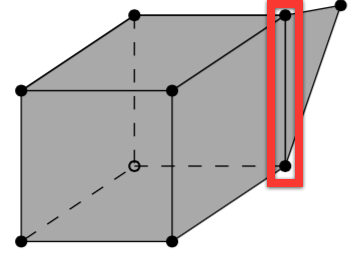
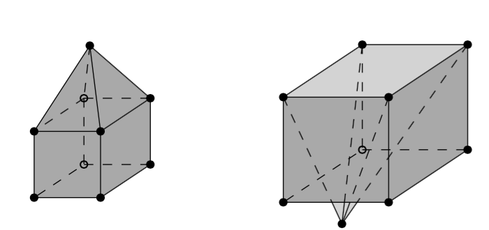

# RING

| 101 -- TOO_FEW_POINTS |
|:--- |
| A ring should have at least 3 points. For GML rings, this error ignores the fact that the first and the last point of a ring are the same (see 103), ie a GML ring should have at least 4 points. |

This ring is for instance invalid:

```xml
<gml:LinearRing>
  <gml:pos>0.0 0.0 0.0</gml:pos>
  <gml:pos>1.0 0.0 0.0</gml:pos>
  <gml:pos>0.0 0.0 0.0</gml:pos>
</gml:LinearRing>
```
| 102 -- CONSECUTIVE_POINTS_SAME |
|:--- |
| Points in a ring should not be repeated (except first-last in case of GML, see 103). This error is for the common error where 2 *consecutive* points are at the same location. Error 104 is for points in a ring that are repeated, but not consecutive. |

This ring is for instance invalid:

```xml
<gml:LinearRing>
  <gml:pos>0.0 0.0 0.0</gml:pos>
  <gml:pos>1.0 0.0 0.0</gml:pos>
  <gml:pos>1.0 0.0 0.0</gml:pos>
  <gml:pos>1.0 1.0 0.0</gml:pos>
  <gml:pos>0.0 1.0 0.0</gml:pos>
  <gml:pos>0.0 0.0 0.0</gml:pos>
</gml:LinearRing>
```

| 103 -- NOT_CLOSED |
|:--- |
| *This applies only to GML rings*. The first and last points have to be identical (at the same location). |

This ring is for instance invalid:

```xml
<gml:LinearRing>
  <gml:pos>0.0 0.0 0.0</gml:pos>
  <gml:pos>1.0 0.0 0.0</gml:pos>
  <gml:pos>1.0 1.0 0.0</gml:pos>
  <gml:pos>0.0 1.0 0.0</gml:pos>
</gml:LinearRing>
```

| 104 -- SELF_INTERSECTION |
|:--- |
| A ring should be *simple*, ie it should not self-intersect. The self-intersection can be at the location of an explicit point, or not. |


| 105 -- COLLAPSED_TO_LINE |
|:--- |
| A special case of self-intersection (104): the ring is collapsed to a line. If the geometry is collapsed to a point, then 101/102 should be used. | 




# POLYGON

| 201: INTERSECTION_RINGS |
|:--- |
| Two or more rings intersect, these can be either the exterior ring with an interior ring or only interior rings.       |



| 202: DUPLICATED_RINGS |
|:--- |
| Two or more rings are identical.  |


| 203: NON_PLANAR_POLYGON_DISTANCE_PLANE |
|:--- |
| A polygon must be planar, ie all its points (used for both the exterior and interior rings) must lie on a plane. To verify this, we must ensure that the the distance between every point and a plane is less than $$\epsilon_1$$, a given *tolerance* (eg 1cm). This plane should be a plane fitted with least-square adjustment. |

| 204: NON_PLANAR_POLYGON_NORMALS_DEVIATION |
|:--- |
| To ensure that cases such as that below are detected (the top polygon is clearly non-planar, but would not be detected with 203 and a tolerance of 1cm for instance) , another requirement is necessary: the distance between every point forming a polygon and *all* the planes defined by all possible combinaisons of 3 non-colinear points is less than $$\epsilon_1$$. In practice it can be implemented with a triangulation of the polygon (any triangulation): the orientation of the normal of each triangle must not deviate more than than a certain usef-defined tolerance $$\epsilon_2$$ (eg 1 degree).     |


| 205: INTERIOR_DISCONNECTED |
|:--- |
| The interior of a polygon must be connected. The combinaison of different valid rings can create such an error, for example: |



| 206: HOLE_OUTSIDE |
|:--- |
| One or more interior ring(s) is(are) located completely outside the exterior ring. If the interior ring intersects the exterior ring, then error 201 should be returned. |


| 207: INNER_RINGS_NESTED |
|:--- |
| One or more interior ring(s) is(are) located completely inside another interior ring. |


| 208: ORIENTATION_RINGS_SAME |
|:--- |
| The interior rings must have the opposite direction (clockwise vs counterclockwise) when viewed from a given point-of-view. When the polygon is used as a bounding surface of a shell, then the rings have to have a specified orientation (see 307/308). |


# SHELL

| 301 -- TOO_FEW_POLYGONS |
|:--- |
| A shell should have at least 4 polygons---the simplest volumetric shape in 3D is a tetrahedron. |


| 302 -- NOT_CLOSED |
|:--- |
| The shell must not have 'holes', ie it must be 'watertight'. This refers only to the topology of the shell, not to its geometry (see 306). |

The left solid is invalid, while the right one is valid (since the hole is filled with other polygons):



| 303 -- NON_MANIFOLD_VERTEX |
|:--- |
| Each shell must be simple, ie it must be a 2-manifold. A vertex is non-manifold when its incident polygons do not form one `umbrella'|



| 304 -- NON_MANIFOLD_EDGE |
|:--- |
| Each edge of a shell should have exactly 2 incident polygons. |



| 305 -- MULTIPLE_CONNECTED_COMPONENTS |
|:--- |
| Polygons that are not connected to the shell should be reported as an error.  |


| 306 -- SELF_INTERSECTION |
|:--- |
| If topology of the shell is correct and the shell is closed (thus no error 301/302/303/304/305), it is possible that the geometry introduces errors, eg intersections. For instance, the topology of both these shells is identical, but the geometry differs. The left shell is valid while the right one is invalid. |



| 307 -- POLYGON_WRONG_ORIENTATION |
|:--- |
| If one polygon is used to construct a shell, its exterior ring must be oriented in such as way that when viewed from outside the shell the points are ordered counterclockwise. |

| 308 -- ALL_POLYGONS_WRONG_ORIENTATION |
|:--- |
| If all the polygons have the wrong orientation (as defined in 307), ie they all point inwards. |

