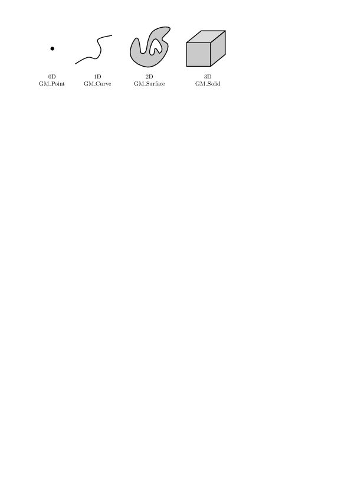
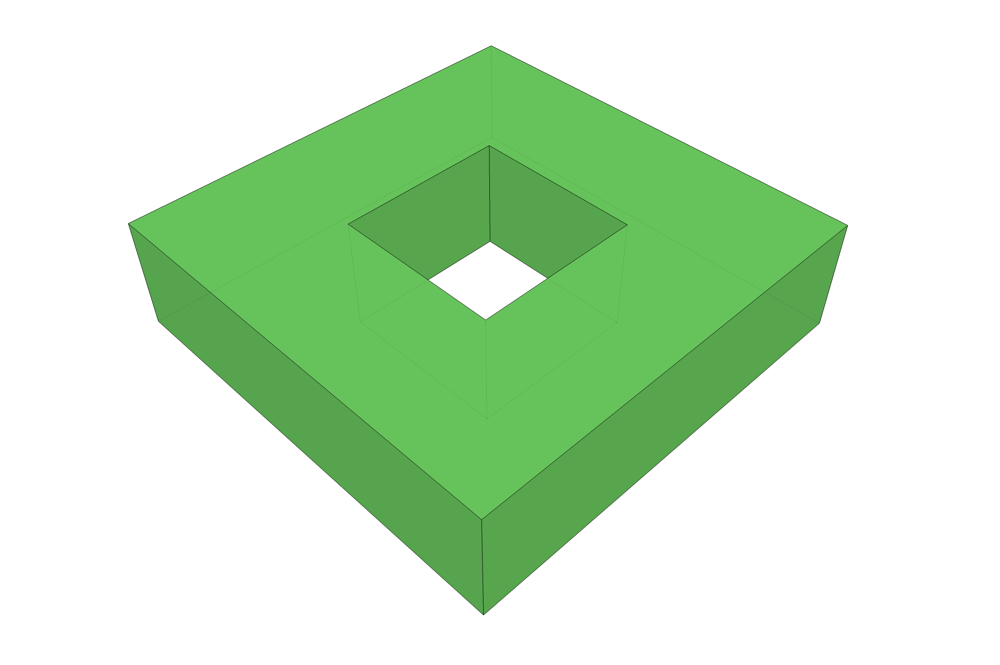

# What is an ISO 19107 solid? [whatiso19107]

ISO 19107[^ISO19107] defines different geometric primitives[^1]: a 0D primitive is a GM\_Point, a 1D a GM\_Curve, a 2D a GM\_Surface, and a 3D a GM\_Solid. A primitive is built with lower-dimensional primitives, eg in the following figure the GM\_Surface is composed of 2 (closed) GM\_Curves, which are composed on several GM\_Points.

Observe that primitives do not need to be linear or planar, ie curves defined by mathematical functions are allowed.

In our context, the following three definitions from ISO19107 are relevant:

> A GM_Solid is the basis for 3-dimensional geometry. The extent of a solid is defined by the boundary surfaces. The boundaries of GM_Solids shall be represented as GM_SolidBoundary. […] The GM_OrientablesSurfaces that bound a solid shall be oriented outward.

> A GM\_Shell is used to represent a single connected component of a GM\_SolidBoundary. It consists of a number of references to GM\_OrientableSurfaces connected in a topological cycle (an object whose boundary is empty). [...] Like GM\_Rings, GM\_Shells are simple.

> A GM\_Object is *simple* if it has no interior point of self-intersection or self-tangency. In mathematical formalisms, this means that every point in the interior of the object must have a metric neighbourhood whose intersection with the object is isomorphic to an *n*-sphere, where *n* is the dimension of this GM\_Object.

The bounding surfaces of a shell thus form a *closed* and *orientable* *two-dimensional manifold* (or 2-manifold for short). A 2-manifold is a space that is topologically equivalent to the 2D Euclidean space. An obvious example is the surface of the Earth, for which near to every point the surrounding area is topologically equivalent to a plane. If we have a shell stored in a data structure, it implies that each edge is guaranteed to have a maximum of two incident faces, and that around each vertex the incident faces form one ‘umbrella’, as shown here:

To be valid shell, the 2-manifold should be closed, ie there should not be 'holes' in the surface (in other words, it should be watertight).

A solid that respects that definition is as follows:

First observe that the solid is composed of two shells (both forming its boundaries), one being the exterior and one being the interior shell. The exterior shell has eleven surfaces, and the interior one six. An interior shell creates a cavity in the solid---cavities are also referred to as 'voids' or holes in a solid. A solid can have no inner shells, or several. Observe that a cavity is not the same as a hole in a torus (a donut) such as that in the following figure: it can be represented with one exterior shell having a genus of 1 and no interior shell.

# Primitives in CityGML

CityGML uses the ISO19107 geometric primitives for representing the geometry of its objects. However, only a subset is used, with the following two restrictions: (1) GM\_Curves can only be *linear* (thus only LineStrings and LinearRings are used); (2) GM\_Surfaces can only be *planar* (thus Polygons are used). The primitives for constructing Shells and Solids are:

A LineString is a Curve with linear interpolation between each Point; each two consecutive Points defines a line segment. A LinearRing is a LineString that is both closed and simple.

A Polygon is a surface patch that is defined by a set of boundary curves and an underlying surface to which these curves adhere. The default is that the curves are coplanar and the polygon uses planar interpolation in its interior.

Each shell of a solid is thus composed of Polygons, and these can have inner rings (which are often referred to as holes). Observe that the top polygon of the ISO solid above has one inner ring, but that other polygons 'fill' that hole so that the exterior shell is 'watertight' (ie it has no holes and is thus closed).

# QIE = no cavaties

It should be noticed that during the QIE, only buildings in LOD1, LOD2 and LOD3 will be considered, and, as a consequence, cavities in solids are ignored.

This imply that a solid has exactly *one* shell representing its exterior boundary. However, this does *not* mean that inner rings in the boundary surfaces are excluded, because simple LOD1 buildings having for instance an inner yard require inner rings, as the 'squared torus' above; an alternative to representing inner rings is to decompose the face into several polygons, eg to triangulate it.

# Requirements for validity of the 3D primitives

Each primitive used to construct a higher-dimensional primitive should be valid. This means that in order to validate a solid, we need to also ensure that each ring and polygon used be valid. For rings and polygons, observe that these will be embedded in 3D (ie the points used to construct rings will have (*x,y,z*) coordinates).

## Rings & Polygons

According to the ISO 19107 abstract specifications, the different boundaries of a polygon are allowed to interact with each other, but only under certain circumstances. The implementation specifications defined by the OGC [^OGC] give clear requirements, see the assertions in Figure [fig:ogcsf~d~efinitions].

  1. Polygons are topologically closed;
  2. The boundary of a Polygon consists of a set of LinearRings that make up its exterior and interior boundaries;
  3. No two Rings in the boundary cross and the Rings in the boundary of a Polygon may intersect at a Point but only as a tangent, eg 
    $$\forall P \in Polygon, \forall c1, c2 \in P.Boundary(), c1 \neq c2,$$
    $$\forall p, q \in Point, p, q \in c1, p \neq q, [p \in c2 \Rightarrow q \notin c2];$$
  4. A Polygon may not have cut lines, spikes or punctures, eg 
    $$\forall P \in Polygon, P = P.Interior.Closure;$$
  5. The interior of every Polygon is a connected point set;
  6. The exterior of a Polygon with 1 or more holes is not connected. Each hole defines a connected component of the exterior.

Some concrete examples of invalid polygons are shown in Figure [fig:p], and here are a few examplanations:

  1. Each ring should be closed (*p*11): its first and its last points should be the same.
  2. Each ring defining the exterior and interior boundaries should be *simple*, ie non-self-intersecting (*p*1 and *p*10). Notice that this prevents the existence of rings with zero-area (*p*6), and of rings having two consecutive points at the same location. It should be observed that the polygon *p*1 is not allowed (in a valid representation of the polygon, the triangle should be represented as an interior boundary touching the exterior boundary).
  3. The rings of a polygon should not cross (*p*3, *p*7, *p*8 and *p*12) but may intersect at one tangent point (the interior ring of *p*2 is a valid case, although *p*2 as a whole is not since the other interior ring is located *outside* the interior one). More than one tangent point is allowed, as long as the interior of the polygon stays connected (see below).
  4. A polygon may not have cut lines, spikes or punctures (*p*5 or *p*6); removing these is known as the *regularisation* of a polygon (a standard point-set topology operation).
  5. The interior of every polygon is a connected point set (*p*4).
  6. Each interior ring creates a new area that is disconnected from the exterior. Thus, an interior ring cannot be located outside the exterior ring (*p*2) or inside other interior rings (*p*9).

## Planarity requirement

A polygon must be planar, ie all its points (used for both the exterior and interior rings) must lie on a plane. Interestingly, the concept of *tolerance* is not mentioned in the standards ISO and OGC.

For the QIE, two requirements are proposed:

  1. the distance between every point forming a polygon and a plane is less than *e*, a given tolerance (eg 1mm). This plane should be a plane fitted with least-square adjustment. 
  2. the distance between every point forming a polygon and all the planes defined by all possible combinaisons of 3 non-colinear points is less than *e*1.

The second requirement is to ensure that cases such as that in Figure [fig:planarity~f~old] are detected.

From algorithmic point of view, the definition is not very efficient, but in practice it can be implemented with a triangulation of the polygon (any triangulation): the orientation of the normal of each triangle must not deviate more than than a certain usef-defined tolerance *e*2 (eg 1 degree).

## Snapping tolerances for vertices

Geometries modelled in CityGML, and in GML in general, store amazingly very little topological relationships. For instance, all six surfaces of a cube are stored independently. This means that the coordinates (*x,y,z*) of a single point (where 3 polygons 'meet') is stored 3 times. It is possible that these 3 vertices are not exactly at the same location, eg (0.01, 0.5, 1.0), (0.011, 0.49999, 1.00004) and (0.01002, 0.5002, 1.0007), and that would create problems when validating since there would for example be tiny cracks/overlaps in the cube. The snap tolerance basically gives a threshold that says: "if 2 points are closer then *e*3, then we assume that they are the same". This value should be defined by the user.

## Orientation requirement

For a polygon embedded in the 2D plane, the orientation of its exterior ring must be the opposite of that of its interior rings (eg clockwise versus counterclockwise).

If one polygon is used to construct a shell, its exterior ring must be oriented in such as way that when viewed from outside the shell the points are ordered counterclockwise. Figure [fig:orientation] shows an example.

In other words, the normal of the surface must point outwards if a right-hand system is used, ie when the ordering of points follows the direction of rotation of the curled fingers of the right hand, then the thumb points towards the outside. If the polygon has interior rings, then these have to be ordered clockwise.

If the polygon is part of a MultiSurface then there is no prescribed orientation, besides the fact that the outer ring must have a different orientation than the inner ring(s).

## Requirements for shells and solids

To understand the requirements for shells and solids, we can simply generalise the assertions in Figure [fig:ogcsf~d~efinitions]: polygons become solids, rings become shells, and holes become cavities.

Figure [fig:valid3d] shows 9 solids, some of them valid some not.

![Nine solids, the number between brackets indicates which assertion(s) is/are violated (Figure [fig:ogcsf~d~efinitions]).](figs/valid3d.pdf)

The first assertion means that a solid must be closed, or ‘watertight’. The solid *s*1 is thus not valid but *s*2 is since the hole in the top surface is 'filled' with other faces.

The second assertion implies that each shell must be simple, ie that it is a 2-manifold. *s*5 and *s*8 are thus invalid.

The fourth assertion states that a shell is a 2-manifold and that no dangling pieces can exist (such as that of *s*3); it is equivalent to the *regularisation* of a point-set in 3D.

The other assertions refer to solids having interior shells, which are out of scope for the QIE. These are thus ignored.

[^1]: All the geometric primitive have the prefix ‘GM\_’
[^ISO19107]: ISO 19107:2003: Geographic information---Spatial schema. International Organization for Standardization (2003).
[^OGC]: OpenGIS implementation specification for geographic information---Simple fea- ture access. Open Geospatial Consortium inc. Document 06-103r3 (2006).
